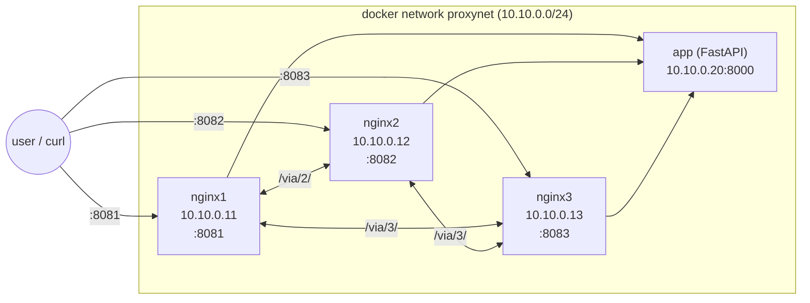
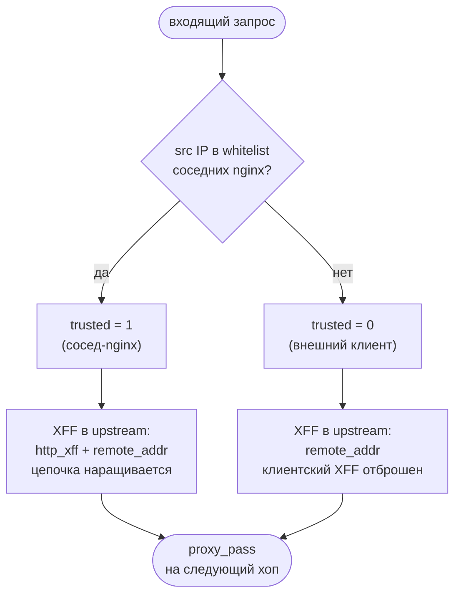
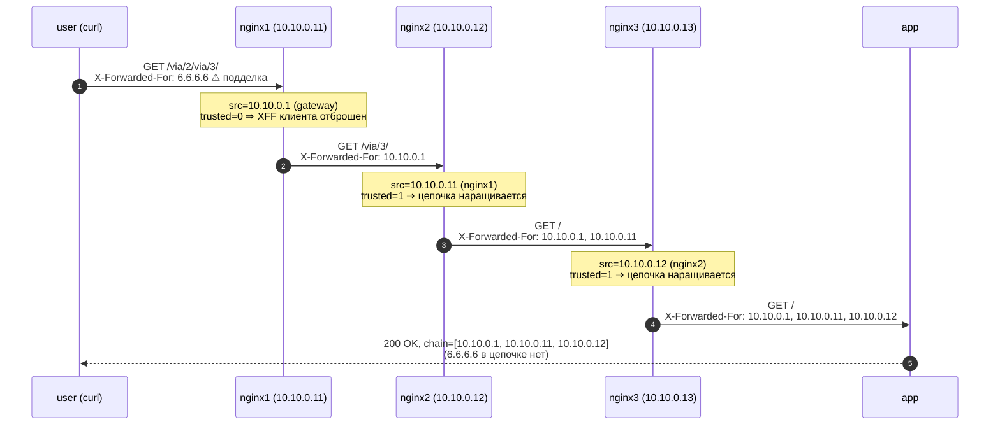

# Тестовое задание: цепочка `X-Forwarded-For` через N nginx

Стенд из 3 nginx-обратных прокси и приложения за ними. Приложение получает заголовок
`X-Forwarded-For`, содержащий **IP клиента и всех nginx, через которые прошёл запрос**,
при этом `X-Forwarded-For`, подсунутый недобросовестным пользователем, **отбрасывается**.

---

## 1. Архитектура



| Компонент | Образ                   | IP в сети `proxynet` | Порт хоста |
|-----------|-------------------------|----------------------|------------|
| `app`     | сборка `./app` (FastAPI)| `10.10.0.20`         | -          |
| `nginx1`  | `nginx:1.27-alpine`     | `10.10.0.11`         | `8081`     |
| `nginx2`  | `nginx:1.27-alpine`     | `10.10.0.12`         | `8082`     |
| `nginx3`  | `nginx:1.27-alpine`     | `10.10.0.13`         | `8083`     |
| gateway   | docker bridge           | `10.10.0.1`          | -          |

IP-адреса контейнеров **зафиксированы** в [`docker-compose.yml`](docker-compose.yml) через
`networks.proxynet.ipam` - это даёт детерминированный whitelist «доверенных прокси».

### Композируемые маршруты

В каждом nginx определены три типа `location`:

- `/` - проксирует напрямую в `app`;
- `/via/<N>/...` - проксирует в `nginxN`, где `N ∈ {1,2,3}` (кроме самого себя).

Это позволяет любой цепочкой URL смоделировать любой путь:

| URL                                        | Маршрут                                |
|--------------------------------------------|----------------------------------------|
| `:8081/`                                   | user → nginx1 → app                    |
| `:8081/via/2/`                             | user → nginx1 → nginx2 → app           |
| `:8081/via/2/via/3/`                       | user → nginx1 → nginx2 → nginx3 → app  |
| `:8083/via/2/via/1/`                       | user → nginx3 → nginx2 → nginx1 → app  |

---

## 2. Как обеспечивается корректность и защита XFF

Стандартный приём `proxy_set_header X-Forwarded-For $proxy_add_x_forwarded_for` **небезопасен**:
он добавит `$remote_addr` к тому, что пришло в заголовке - а пришло там может быть
подделано клиентом.

Решение реализуется двумя директивами в каждом nginx (см. [`nginx/nginx1.conf`](nginx/nginx1.conf)):

```nginx
geo $is_trusted_proxy {
    default        0;
    10.10.0.12/32  1;   # nginx2
    10.10.0.13/32  1;   # nginx3
}

map $is_trusted_proxy $xff_value {
    0  $remote_addr;                            # внешний клиент - фейковый XFF отбрасывается
    1  "$http_x_forwarded_for, $remote_addr";   # сосед-nginx - наращиваем цепочку
}

location / {
    proxy_set_header X-Forwarded-For $xff_value;
    proxy_pass http://app;
}
```

Логика принятия решения на каждом nginx:



Свойства:

- `geo` сопоставляет `$remote_addr` источника TCP-соединения с whitelist-ом IP соседних nginx.
  IP подделать на TCP-уровне через docker-bridge нельзя.
- Внешний клиент (приходит с docker gateway `10.10.0.1` или с любого «не из whitelist»)
  → `trusted=0` → его `X-Forwarded-For` **полностью игнорируется**, в upstream уходит только
  его реальный `$remote_addr`.
- Доверенный сосед-nginx (приходит с одного из `10.10.0.11/12/13`) → `trusted=1` → его XFF
  принимается и дополняется своим `$remote_addr`.
- Хвост цепочки в `app` всегда выглядит как
  `client_ip, nginx_A_ip, nginx_B_ip, ..., nginx_last_ip` - ровно в том порядке, в котором
  запрос реально шёл.

Самоподтверждение в `app`: эндпоинт возвращает JSON с распарсенной цепочкой
`x_forwarded_for_chain` и `x_forwarded_for_hops`.

### Пример работы (case-12): атака на 3-хоповую цепочку



---

## 3. Структура репозитория

```
.
├── README.md
├── docker-compose.yml
├── .gitignore
├── app/
│   ├── Dockerfile
│   ├── requirements.txt
│   └── app.py
├── nginx/
│   ├── nginx1.conf
│   ├── nginx2.conf
│   └── nginx3.conf
└── tests/
    └── run_tests.sh
```

---

## 4. Запуск

Требования: Docker 24+ и Docker Compose v2. Свободные порты `8081/8082/8083`.

```bash
# 1. Поднять стенд
docker compose up -d --build

# 2. Дождаться healthy у app
docker compose ps

# 3. Прогнать автоматический протокол
bash tests/run_tests.sh

# 4. (опц.) посмотреть логи nginx с подсветкой trusted-флага
docker compose logs -f nginx1 nginx2 nginx3

# 5. Остановить
docker compose down -v
```

---

## 5. Протокол тестирования (`curl`)

Скрипт [`tests/run_tests.sh`](tests/run_tests.sh) автоматизирует все кейсы ниже:
печатает выполненный `curl`, ответ приложения, извлекает `x_forwarded_for_chain`,
сравнивает «хвост» цепочки (всё после IP клиента) с ожидаемым и ставит `PASS/FAIL`.
Дополнительно скрипт проверяет, что **ни одно** из подделанных значений из
`-H X-Forwarded-For: ...` не просочилось в цепочку.

> В стенде клиент `curl` запускается с хоста, поэтому app видит его как docker
> gateway `10.10.0.1`. В таблице ниже это - «`<client>`».
>
> Если в системе задан HTTP-прокси (`http_proxy`/`https_proxy`, например, Cloudflare
> WARP), при ручных вызовах `curl` добавляйте `--noproxy '*'` - иначе запросы пойдут
> через системный прокси, минуя стенд. В `run_tests.sh` это уже сделано.

### 5.1. Прямой проход через каждый nginx

| # | Команда | Ожидаемый `X-Forwarded-For` |
|---|---------|-----------------------------|
| 1 | `curl -s http://localhost:8081/` | `<client>` |
| 2 | `curl -s http://localhost:8082/` | `<client>` |
| 3 | `curl -s http://localhost:8083/` | `<client>` |

### 5.2. Цепочки из 2-х nginx

| # | Команда | Ожидаемый `X-Forwarded-For` |
|---|---------|-----------------------------|
| 4 | `curl -s http://localhost:8081/via/2/` | `<client>, 10.10.0.11` |
| 5 | `curl -s http://localhost:8082/via/3/` | `<client>, 10.10.0.12` |
| 6 | `curl -s http://localhost:8083/via/1/` | `<client>, 10.10.0.13` |

### 5.3. Цепочки из 3-х nginx

| # | Команда | Ожидаемый `X-Forwarded-For` |
|---|---------|-----------------------------|
| 7 | `curl -s http://localhost:8081/via/2/via/3/` | `<client>, 10.10.0.11, 10.10.0.12` |
| 8 | `curl -s http://localhost:8083/via/2/via/1/` | `<client>, 10.10.0.13, 10.10.0.12` |
| 9 | `curl -s http://localhost:8082/via/1/via/3/` | `<client>, 10.10.0.12, 10.10.0.11` |

### 5.4. Атаки: клиент подсовывает фейковый XFF

Во всех случаях фейк должен **полностью отсутствовать** в цепочке, видимой приложением.

| # | Команда | Ожидаемый `X-Forwarded-For` |
|----|---------|-----------------------------|
| 10 | `curl -s -H 'X-Forwarded-For: 1.2.3.4' http://localhost:8081/` | `<client>` |
| 11 | `curl -s -H 'X-Forwarded-For: 1.2.3.4, 5.6.7.8' http://localhost:8082/` | `<client>` |
| 12 | `curl -s -H 'X-Forwarded-For: 6.6.6.6' http://localhost:8081/via/2/via/3/` | `<client>, 10.10.0.11, 10.10.0.12` |
| 13 | `curl -s -H 'X-Forwarded-For: evil.example.com' http://localhost:8083/via/2/via/1/` | `<client>, 10.10.0.13, 10.10.0.12` |

### 5.5. Пример «сырого» вывода (case-12)

```bash
$ curl -s -H 'X-Forwarded-For: 6.6.6.6' http://localhost:8081/via/2/via/3/ | python3 -m json.tool
{
    "path": "/",
    "method": "GET",
    "immediate_peer": "10.10.0.13",
    "x_forwarded_for_raw": "10.10.0.1, 10.10.0.11, 10.10.0.12",
    "x_forwarded_for_chain": [
        "10.10.0.1",
        "10.10.0.11",
        "10.10.0.12"
    ],
    "x_forwarded_for_hops": 3,
    "headers": { "...": "..." }
}
```

`6.6.6.6` отсутствует - защита сработала. `immediate_peer` - это nginx3 (последний
в цепочке), что согласуется с маршрутом `user → nginx1 → nginx2 → nginx3 → app`.

---

## 6. Аналитика: что я бы доработал перед раскаткой в прод

Стенд закрывает поставленную задачу, но до прод-готовности тут ещё работа. Ниже мои
наблюдения по слабым местам решения и тому, как я бы их закрывал.

**Модель доверия.** Whitelist прибит к трём фиксированным IP через `geo`. Для демо это
нормально, но в реальной сети адреса в `nginx.conf` руками я держать не стал бы. Вариант
первый: генерировать `geo`-блок из source of truth (inventory / CMDB) на этапе деплоя.
Вариант второй: переходить на mTLS между nginx-узлами и считать признаком доверия валидный
клиентский сертификат, а не source IP. mTLS прочнее: не ломается при смене IP и не страдает,
если в L2-сегменте вдруг окажется лишний хост.

`set_real_ip_from` + `real_ip_header X-Forwarded-For` + `real_ip_recursive on` можно
использовать параллельно. Они удобны для корректного `$remote_addr` в `access_log` и для
rate-limit зон по реальному клиентскому IP, но саму задачу "как отличить внешний XFF от
внутреннего" эти директивы не решают: чистить клиентский заголовок на первом хопе всё равно
нужно явно.

**Цепочка перед нашим фронтом.** Если перед фронтовым nginx стоит ещё один прокси (облачный
LB, ingress-контроллер, CDN), его IP обязан быть в whitelist. Иначе цепочка XFF на стороне
приложения начнётся не с клиента, а с LB, и весь смысл теряется. На реальных проектах я
прохожу путь запроса от точки входа в DC и явно фиксирую все промежуточные узлы, включая
те, которые "и так наши".

**Ограничение длины цепочки.** Количество хопов в этой схеме формально не ограничено:
каждый `proxy_pass` наращивает XFF, пока запрос ходит между nginx. В проде я бы выставил
жёсткий потолок на стороне приложения: пришло больше N адресов (например, N=10), отвечаем
400. Это страховка и от случайных циклов в конфигурации, и от попыток разогреть длину
заголовка ради DoS на парсер.

**Логи и метрики.** Сейчас в `log_format xff` пишу `trusted=`, `xff_in`, `xff_out` и
`upstream_addr`: для разбора инцидентов хватает. В проде то же самое стоит писать в JSON
и сразу в централизованный сборщик (ELK / Loki). Отдельно я бы вынес в Prometheus метрику
количества запросов с `trusted=0` и непустым входящим XFF: это фактически индикатор
сканирования или попытки подмены, и его удобно держать на дашборде с алёртом.

**Транспорт.** Стенд работает по HTTP. На внешнем периметре, разумеется, нужны TLS, HSTS
и нормальная цепочка сертификатов. Между nginx внутри DMZ либо TLS, либо явно изолированный
сегмент сети. Plain HTTP между прокси я допустил бы только при условии, что они физически
в одном trust-domain и сетевая граница не пересекается ничем посторонним.

**Прочее на фронтовом nginx.** Сама задача про XFF, но раз речь про прод-периметр:
фронтовый nginx это естественное место для `limit_req_zone`, антибота, fail2ban-интеграции
и базового набора WAF-правил. Эти механизмы я предпочитаю включать сразу, до первого
инцидента, а не задним числом.

**Повторяющиеся XFF от клиента.** RFC допускает повтор одноимённых заголовков. nginx
через `$http_x_forwarded_for` возьмёт только первое значение. В нашей схеме это безопасно:
клиентский XFF на первом хопе всё равно отбрасывается полностью. Но если когда-нибудь
будем менять логику и пробрасывать клиентский XFF дальше, это поведение надо учитывать.

---

## 7. Команды быстрой диагностики

```bash
# увидеть фактически отправленные заголовки на каждом хопе
docker compose logs nginx1 | tail -n 20
docker compose logs nginx2 | tail -n 20
docker compose logs nginx3 | tail -n 20

# выполнить запрос изнутри сети (от имени nginx1) и убедиться, что app видит nginx1 как peer
docker compose exec nginx1 sh -c 'apk add --no-cache curl >/dev/null 2>&1; curl -s http://app:8000/ | head -c 500'

# проверить, что app действительно не доступен наружу
curl -s --max-time 2 http://localhost:8000/ || echo "ok: app не опубликован наружу"
```
